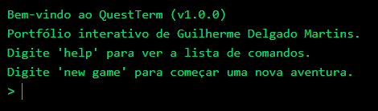

# QuestTerm 🚀

<p align="center">
  
</p>

<p align="center">
  <strong>Um portfólio de desenvolvedor interativo, disfarçado de terminal CLI com um RPG completo.</strong>
</p>

<p align="center">
  
  
  
  
</p>

---

## 🎮 O Projeto

**QuestTerm** é a minha solução para o clássico portfólio de desenvolvedor. Em vez de apenas _ler_ sobre minhas habilidades, você pode _interagir_ com elas.

O projeto se apresenta como um terminal de linha de comando onde você pode usar comandos Unix-like (`help`, `projects`, `skills`, `contact`) para navegar pelo meu perfil profissional.

**...Mas há um "pulo do gato" (Easter Egg):**
O terminal também é um "motor" de jogo. Ao digitar `new game`, você inicia um mini-RPG completo, com classes, níveis, combate em turnos, loot, loja e persistência de dados.

### ➡️ [Clique aqui para jogar (Live Demo)](https://guigasprog.github.io/QuestTerm/)



## ✨ Funcionalidades (Comandos)

### Comandos do Portfólio

- `help`: Lista todos os comandos disponíveis.
- `projects`: Busca e exibe meus repositórios reais e fixados, diretamente da API do GitHub.
- `open [numero]`: Abre o link de um projeto do GitHub em uma nova aba.
- `pn` / `patchnotes`: Exibe os últimos commits (atualizações) do projeto em tempo real.
- `skills`: Lista as tecnologias e habilidades que eu domino.
- `contact`: Exibe minhas informações de contato profissional.
- `clear`: Limpa o histórico do terminal.

### Comandos do RPG (Quest)

- `new game` / `ng`: Inicia um novo jogo. Permite selecionar entre 5 classes (Guerreiro, Ladino, Mago, Clérigo, Caçador e Druida).
- `abandon character`: Apaga seu personagem salvo e o envia para o Memorial.
- `memorial`: Exibe o "Hall da Fama" com os dados do último herói caído.
- `stats`: Exibe status detalhados (HP com barra visual, Ouro, XP, Atributos e Invocações).
- `train [str|dex|int]`: Gasta Stamina (limitada a 3x/dia) para treinar um atributo específico.
- `evolve [classe]`: (Nível 10 e 20) Evolui sua classe para uma especialização ou classe de Elite.
- `abilities`: Lista todas as magias e habilidades aprendidas.
- `i` / `inventory`: Mostra os itens no inventário.
- `use [item]`: Usa uma poção de cura ou buff (fora de combate).
- `equip [item]`: Equipa uma arma ou armadura do inventário (afeta os atributos).
- `shop`: Visita a loja, que possui estoque rotativo (atualiza a cada 1 hora).
- `buy [numero]`: Compra um item da loja com Ouro.
- `sell [item] [qtd]`: Vende itens do inventário por Ouro.
- `f` / `find battle`: Procura por uma batalha (a dificuldade escala com o nível).

### Comandos de Combate

- `a` / `attack`: Realiza um ataque básico físico.
- `cast [magia]`: Lança uma magia ofensiva ou de invocação (ex: `cast Bola de Fogo`, `cast Criar Golem`).
- `use [habilidade/item]`: Usa uma habilidade física (ex: `use Grito de Guerra`) ou consome um item.
- `run`: Tenta fugir da batalha (chance baseada em `DEX` e nível do monstro).
- `stats`: (Ação Livre) Mostra a vida e status do jogador e do monstro sem gastar o turno.

## 🛠️ Arquitetura e Stack

Este projeto foi construído com foco em uma arquitetura moderna, limpa e escalável, usando **TypeScript** em todo o código.

- **Framework:** **Next.js** (React)
- **Estilização:** **TailwindCSS** (para a UI do terminal)
- **Lógica de Estado (Cérebro do Jogo):** Hooks do React (`useReducer` e `useState`). Toda a lógica do jogo (combate, inventário, loja, evolução, etc.) é gerenciada em um único hook customizado: `useTerminalLogic`.
- **Tipagem:** **TypeScript** (Interfaces estritas para Itens, Monstros, Classes, Skills e Save Data).
- **Persistência:** `localStorage` do navegador. O estado do jogo e o memorial são salvos localmente, permitindo continuar de onde parou.
- **API Externa:** **GitHub API** (para popular dinamicamente as seções `projects` e `patchnotes`).
- **Deploy:** **GitHub Pages**, configurado para exportação estática (`output: 'export'`) e deploy automatizado via **GitHub Actions**.

## 🚀 Como Rodar Localmente

1.  **Clone o repositório:**

    ```bash
    git clone [https://github.com/guigasprog/QuestTerm.git](https://github.com/guigasprog/QuestTerm.git)
    cd QuestTerm
    ```

2.  **Instale as dependências:**

    ```bash
    npm install
    ```

3.  **Rode o servidor de desenvolvimento:**

    ```bash
    npm run dev
    ```

4.  **Acesse:**
    Abra [http://localhost:3000](http://localhost:3000) no seu navegador.

---

_Este projeto foi um desafio divertido de arquitetura de software, design de jogos e UI. Feito por Guilherme Delgado Martins._
